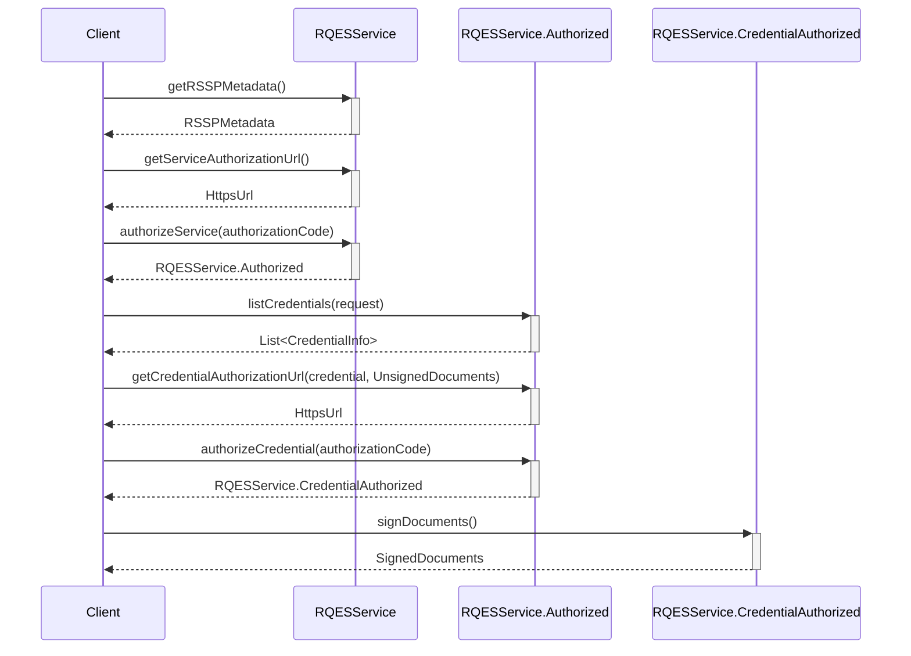

# EUDI Remote Qualified Electronic Signature (RQES) Core library for Android

:heavy_exclamation_mark: **Important!** Before you proceed, please read
the [EUDI Wallet Reference Implementation project description](https://github.com/eu-digital-identity-wallet/.github/blob/main/profile/reference-implementation.md)

## Overview

This module provides the core functionality for the EUDI Wallet, focusing on the Remote Qualified
Electronic Signature (RQES) service. The `RQESService` interface defines methods for obtaining
credential authorization URLs, authorizing credentials, and signing documents. It ensures secure and
compliant electronic signatures by interacting with authorized credentials and handling document
signing processes.

## Requirements

- Android 8 (API level 26) or higher

### Dependencies

To use snapshot versions add the following to your project's settings.gradle file:

```kotlin
dependencyResolutionManagement {
    repositories {
        // .. other repositories
        maven {
            url = uri("https://s01.oss.sonatype.org/content/repositories/snapshots/")
            mavenContent { snapshotsOnly() }
        }
    }
}
```

To include the library in your project, add the following dependencies to your app's build.gradle
file.

```kotlin
dependencies {
    // EUDI Wallet RQES service library
    implementation("eu.europa.ec.eudi:eudi-lib-android-rqes-core:0.1.0")
}
```

## Document signing flow



## How to use

At first, construct an instance of the `RQESService` like shown below:

```kotlin
val rqesService = RQESService(
    serviceEndpointUrl = "https://example.com/csc/v2",
    config = CSCClientConfig(
        client = OAuth2Client.Confidential.ClientSecretBasic(
            clientId = "client-id",
            clientSecret = "client-secret"
        ),
        authFlowRedirectionURI = URI("rqes:redirect"),
        scaBaseURL = URL("https://example.com"),
    ),
    // set the hashing algorithm that will be used
    // default is SHA-256 as shown below
    hashAlgorithm = HashAlgorithmOID.SHA_256, 
    // optionally provide a HttpClientFactory to create a HttpClient for the service
    // this is useful for logging, testing, etc.
    httpClientFactory = {
        // create a HttpClient
        HttpClient(/* Configure */)
    }
)
```

You can get the metadata of the RQES service by calling the `getRSSPMetadata` method:

```kotlin
val metadata = rqesService.getRSSPMetadata().getOrThrow()
``` 

To authorize the service, you need to get the authorization URL and open it in a browser. After the
user has authorized the service, the browser will be redirected to the `authFlowRedirectionURI`,
that
is configured in the `CSCClientConfig`, with a query parameter named `code` containing the
authorization code. You can then authorize the service by calling the `authorizeService` method:

```kotlin
val authorizationUrl = rqesService.getServiceAuthorizationUrl().getOrThrow()

// Open the authorizationUrl in a browser
// After the user has authorized the service, the browser will be redirected to the authFlowRedirectionURI
// with a query parameter named "code" containing the authorization code

val authorizationCode = AuthorizationCode("code")
val authorizedService = rqesService.authorizeService(authorizationCode).getOrThrow()
```

With the authorized service, you can list the available credentials by calling the `listCredentials`
method.

You can then select the credential you want to use, prepare the documents to sign, and get
the credential authorization URL by calling the `getCredentialAuthorizationUrl` method. After the
user has authorized the credential, you can authorize it by calling the `authorizeCredential`
method.

Finally, you can sign the documents by calling the `signDocuments` method.

```kotlin
// Use the credentials to select the one you want to use
val credentials = authorizedService.listCredentials().getOrThrow()
// For example, select the first credential
val credential = credentials.first()

// Prepare the documents to sign
val unsignedDocuments = UnsignedDocuments(
    UnsignedDocument(
        label = "Document to sign",
        file = File("document.pdf"),
        // Optionally,you can change the signing configuration if needed otherwise the
        // default configuration will be used
        signingConfig = UnsignedDocument.Config(
            signatureFormat = SignatureFormat.P,
            conformanceLevel = ConformanceLevel.ADES_B_B,
            signedEnvelopeProperty = SignedEnvelopeProperty.ENVELOPED,
            asicContainer = ASICContainer.NONE
        )
    )
)


// Use the credentialAuthorizationUrl to open a browser and let the user authorize the
// credential
val credentialAuthorizationUrl = authorizedService.getCredentialAuthorizationUrl(
    credential = credential,
    documents = unsignedDocuments,
    // optionally provide the signing algorithm to use when signing the documents
    // if not provided the first available supported algorithm from the credential 
    // will be used
    signingAlgorithmOID = SigningAlgorithmOID.ECDSA_SHA256
).getOrThrow()

// After the user has authorized the credential will be redirected to the
// authFlowRedirectionURI with a query parameter named "code" containing the
// authorization code
val credentialAuthorizationCode = AuthorizationCode("credential-code")

val authorizedCredential =
    authorizedService.authorizeCredential(authorizationCode).getOrThrow()

// Sign the documents
val signedDocuments = authorizedCredential.signDocuments().getOrThrow()

// Manipulate the signed documents. For example, save them to disk
signedDocuments.forEachIndexed { index, inputStream ->
    // Save the signed document
    inputStream.use { signedDocument ->
        File("signed-document-$index.pdf").outputStream()
            .use { signedDocument.copyTo(it) }
    }
}
```

## How to contribute

We welcome contributions to this project. To ensure that the process is smooth for everyone
involved, follow the guidelines found in [CONTRIBUTING.md](CONTRIBUTING.md).

## License

### Third-party component licenses

See [licenses.md](licenses.md) for details.

### License details

Copyright (c) 2024 European Commission

Licensed under the Apache License, Version 2.0 (the "License");
you may not use this file except in compliance with the License.
You may obtain a copy of the License at

    http://www.apache.org/licenses/LICENSE-2.0

Unless required by applicable law or agreed to in writing, software
distributed under the License is distributed on an "AS IS" BASIS,
WITHOUT WARRANTIES OR CONDITIONS OF ANY KIND, either express or implied.
See the License for the specific language governing permissions and
limitations under the License.
