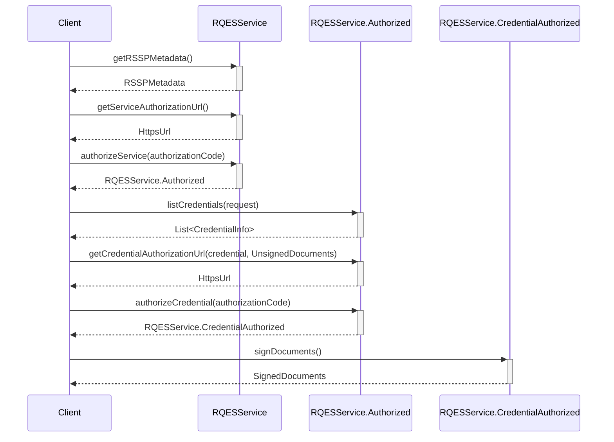

# EUDI Remote Qualified Electronic Signature (RQES) Core library for Android

:heavy_exclamation_mark: **Important!** Before you proceed, please read
the [EUDI Wallet Reference Implementation project description](https://github.com/eu-digital-identity-wallet/.github/blob/main/profile/reference-implementation.md)

## Overview

This module provides the core functionality for the EUDI Wallet, focusing on the Remote Qualified
Electronic Signature (RQES) service. The `RQESService` interface defines methods for obtaining
credential authorization URLs, authorizing credentials, and signing documents. It ensures secure and
compliant electronic signatures by interacting with authorized credentials and handling document
signing processes.

## Requirements

- Android 8 (API level 29) or higher

### Dependencies

To use snapshot versions add the following to your project's settings.gradle file:

```kotlin
dependencyResolutionManagement {
    repositories {
        // .. other repositories
        maven {
            url = uri("https://central.sonatype.com/repository/maven-snapshots/")
            mavenContent { snapshotsOnly() }
        }
    }
}
```

To include the library in your project, add the following dependencies to your app's build.gradle
file.

```kotlin
dependencies {
    // EUDI Wallet RQES service library
    implementation("eu.europa.ec.eudi:eudi-lib-android-rqes-core:0.4.0-SNAPSHOT")
}
```

## Document signing flow



## How to use

At first, construct an instance of the `RQESService` like shown below:

```kotlin
val rqesService = RQESService(
    serviceEndpointUrl = "https://example.com/csc/v2",
    config = CSCClientConfig(
        client = OAuth2Client.Confidential.ClientSecretBasic(
            clientId = "client-id",
            clientSecret = "client-secret"
        ),
        authFlowRedirectionURI = URI("rqes:redirect"),
    ),
    outputPathDir = "/path/to/output/dir",
    // set the hashing algorithm that will be used
    // default is SHA-256 as shown below
    hashAlgorithm = HashAlgorithmOID.SHA_256,
    // optionally provide a HttpClientFactory to create a HttpClient for the service
    // this is useful for logging, testing, etc.
    httpClientFactory = {
        // create a HttpClient
        HttpClient(/* Configure */)
    }
)
```

You can get the metadata of the RQES service by calling the `getRSSPMetadata` method:

```kotlin
val metadata = rqesService.getRSSPMetadata().getOrThrow()
``` 

To authorize the service, you need to get the authorization URL and open it in a browser. After the
user has authorized the service, the browser will be redirected to the `authFlowRedirectionURI`,
that
is configured in the `CSCClientConfig`, with a query parameter named `code` containing the
authorization code. You can then authorize the service by calling the `authorizeService` method:

```kotlin
val authorizationUrl = rqesService.getServiceAuthorizationUrl().getOrThrow()

// Open the authorizationUrl in a browser
// After the user has authorized the service, the browser will be redirected to the authFlowRedirectionURI
// with a query parameter named "code" containing the authorization code

val authorizationCode = AuthorizationCode("code")
val authorizedService = rqesService.authorizeService(authorizationCode).getOrThrow()
```

With the authorized service, you can list the available credentials by calling the `listCredentials`
method.

You can then select the credential you want to use, prepare the documents to sign, and get
the credential authorization URL by calling the `getCredentialAuthorizationUrl` method. After the
user has authorized the credential, you can authorize it by calling the `authorizeCredential`
method.

Finally, you can sign the documents by calling the `signDocuments` method.

```kotlin
// Use the credentials to select the one you want to use
val credentials = authorizedService.listCredentials().getOrThrow()
// For example, select the first credential
val credential = credentials.first()

// Prepare the documents to sign
val unsignedDocuments = UnsignedDocuments(
    UnsignedDocument(
        label = "Document to sign",
        file = File("document.pdf"),
        // Optionally,you can change the signing configuration if needed otherwise the
        // default configuration will be used
        signingConfig = UnsignedDocument.Config(
            signatureFormat = SignatureFormat.P,
            conformanceLevel = ConformanceLevel.ADES_B_B,
            signedEnvelopeProperty = SignedEnvelopeProperty.ENVELOPED,
            asicContainer = ASICContainer.NONE
        )
    )
)


// Use the credentialAuthorizationUrl to open a browser and let the user authorize the
// credential
val credentialAuthorizationUrl = authorizedService.getCredentialAuthorizationUrl(
    credential = credential,
    documents = unsignedDocuments,
    // optionally provide the signing algorithm to use when signing the documents
    // if not provided the first available supported algorithm from the credential 
    // will be used
    signingAlgorithmOID = SigningAlgorithmOID.ECDSA_SHA256
).getOrThrow()

// After the user has authorized the credential will be redirected to the
// authFlowRedirectionURI with a query parameter named "code" containing the
// authorization code
val credentialAuthorizationCode = AuthorizationCode("credential-code")

val authorizedCredential =
    authorizedService.authorizeCredential(credentialAuthorizationCode).getOrThrow()

// Sign the documents
val signedDocuments = authorizedCredential.signDocuments().getOrThrow()

// Manipulate the signed documents
signedDocuments.forEach { (label, file) ->
    // Use the signed file
    val fileContent = file.readBytes()
}

// Alternatively, you can use the extension function to sign the documents
// directly from the authorized service without the need to call authorizeCredential
// method first and then call signDocuments method
val signedDocumentsAlt = authorizedService.signDocuments(credentialAuthorizationCode).getOrThrow()
```

### Document Retrieval

This library is also implements a Document Retrieval functionality, that allows to retrieve the
documents to be signed from a RP and to provide back the signed documents or signatures.

The interactions with the RP happen via the DocumentRetrievalService, which is a separate service
from the RQES service.

```kotlin 
// X509CertificateTrust implementation for the supported client id schemes
// Library provides a default implementation of the X509CertificateTrust interface that validates
// the path of the certificate chain and checks the trust anchor against a list of trusted certificates
val x509CertificateTrust = X509CertificateTrust(
    trustedCertificates = listOf(
        // Add the trusted certificates
    ),
    // if you want to log the errors, you can provide a logger
    logException = { th: Throwable -> th.printStackTrace() }
)

// or
// provide own implementation of the X509CertificateTrust interface

// Instantiate the DocumentRetrievalService with the required configuration
val documentRetrievalService = DocumentRetrievalService(
    downloadTempDir = File(context.cacheDir, "downloads"),
    config = DocumentRetrievalConfig(
        jarConfiguration = JarConfiguration.Default,
        supportedClientIdSchemes = listOf(
            SupportedClientIdScheme.X509SanUri(x509CertificateTrust),
            SupportedClientIdScheme.X509SanDns(x509CertificateTrust),
        ),
    )
)

// Given a request URI, resolve the document(s)
val requestUri = Uri.parse("mdoc-openid4vp://...?request_uri=...&client_id=...")
val resolutionOutcome = documentRetrievalService.resolveDocument(requestUri).getOrThrow()


// Prepare the documents to sign

val resolvedDocuments = resolutionOutcome.resolvedDocuments

val unsignedDocuments = resolvedDocuments.toUnsignedDocuments(
    signingConfig = UnsignedDocument.Config.DEFAULT
)

// Follow the same steps as above to sign the documents using the RQES service
// When you get the signed documents, you can dispatch them using the dispatch method

// Send the signed documents using the dispatch method of the resolution outcome
val dispatchOutcome = resolutionOutcome.dispatch(signedDocuments)
// Handle the dispatch outcome
when (dispatchOutcome) {
    is DispatchOutcome.Accepted -> {
        val redirectUri = dispatchOutcome.redirectURI
        // redirect the user to the redirectUri
    }

    DispatchOutcome.Rejected -> {
        // handle the rejection
    }
}
```

#### Notes

- `SignedDocuments` implements the `Map` interface, with document labels as keys and corresponding signed document `File` objects as values. This allows for easy access to the signed files using their labels:
  ```kotlin
  // Access the signed documents by their labels
  signedDocuments.forEach { (label, file) ->
      // Use the signed file
      val fileContent = file.readBytes()
  }
  ```
- If you want to use the `X509CertificateTrust` implementation provided by the library with
  BouncyCastle you must add the following dependencies to your project's build.gradle file:
    ```kotlin
    dependencies {
        // BouncyCastle
        implementation("org.bouncycastle:bcprov-jdk15on:1.78.1")
        implementation("org.bouncycastle:bcpkix-jdk15on:1.78.1")
    }
    ```
    
    Also, you need to add the BouncyCastle provider to the Security providers list:
    
    ```kotlin
    Security.addProvider(BouncyCastleProvider())
    ```

## How to contribute

We welcome contributions to this project. To ensure that the process is smooth for everyone
involved, follow the guidelines found in [CONTRIBUTING.md](CONTRIBUTING.md).

## License

### Third-party component licenses

See [licenses.md](licenses.md) for details.

### License details

Copyright (c) 2024 European Commission

Licensed under the Apache License, Version 2.0 (the "License");
you may not use this file except in compliance with the License.
You may obtain a copy of the License at

    http://www.apache.org/licenses/LICENSE-2.0

Unless required by applicable law or agreed to in writing, software
distributed under the License is distributed on an "AS IS" BASIS,
WITHOUT WARRANTIES OR CONDITIONS OF ANY KIND, either express or implied.
See the License for the specific language governing permissions and
limitations under the License.

