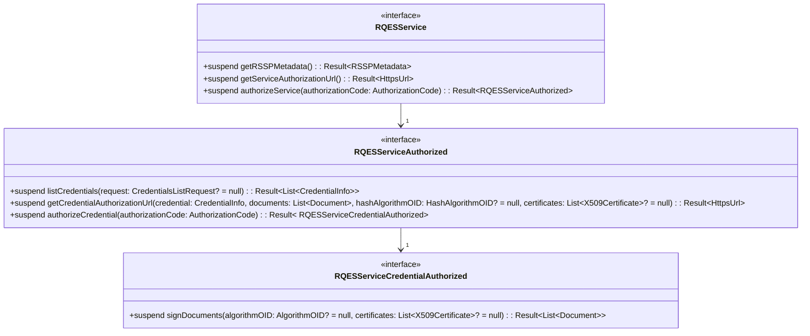
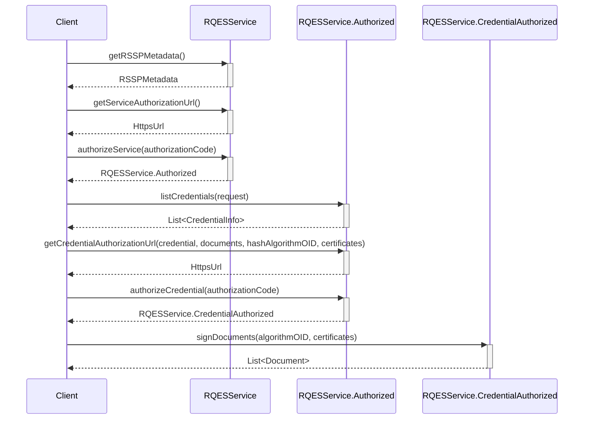

# EUDI Remote Qualified Electronic Signature (RQES) Core library for Android

:heavy_exclamation_mark: **Important!** Before you proceed, please read
the [EUDI Wallet Reference Implementation project description](https://github.com/eu-digital-identity-wallet/.github/blob/main/profile/reference-implementation.md)

## Overview

This module provides the core functionality for the EUDI Wallet, focusing on the Remote Qualified
Electronic Signature (RQES) service. The `RQESService` interface defines methods for obtaining
credential authorization URLs, authorizing credentials, and signing documents. It ensures secure and
compliant electronic signatures by interacting with authorized credentials and handling document
signing processes.

## Document signing flow

## How to contribute

We welcome contributions to this project. To ensure that the process is smooth for everyone
involved, follow the guidelines found in [CONTRIBUTING.md](CONTRIBUTING.md).

## License

### Third-party component licenses

See [licenses.md](licenses.md) for details.

### License details

Copyright (c) 2023 European Commission

Licensed under the Apache License, Version 2.0 (the "License");
you may not use this file except in compliance with the License.
You may obtain a copy of the License at

    http://www.apache.org/licenses/LICENSE-2.0

Unless required by applicable law or agreed to in writing, software
distributed under the License is distributed on an "AS IS" BASIS,
WITHOUT WARRANTIES OR CONDITIONS OF ANY KIND, either express or implied.
See the License for the specific language governing permissions and
limitations under the License.